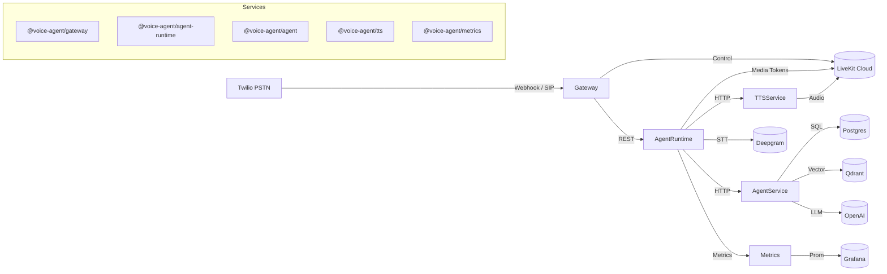
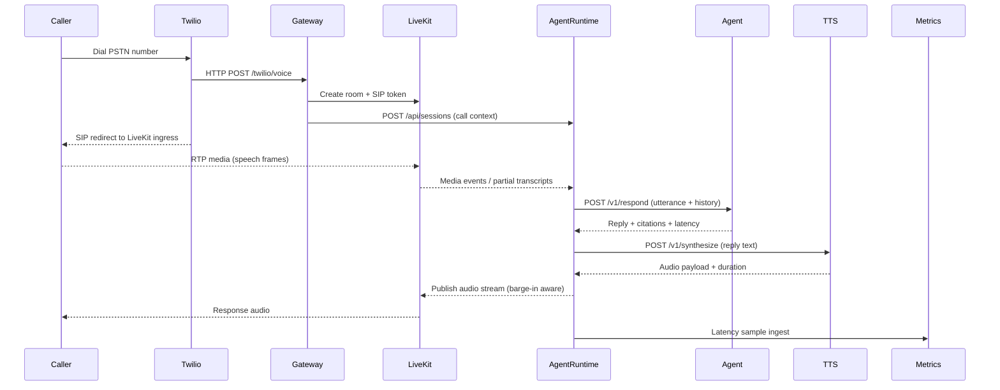
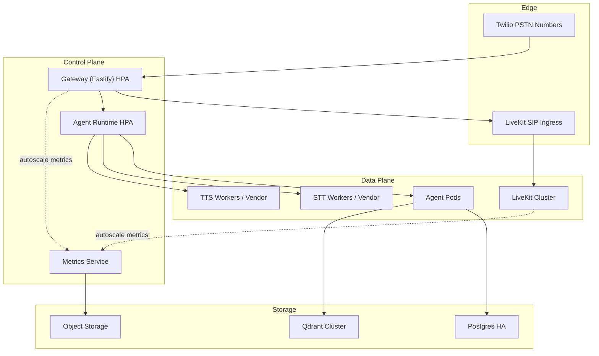

# Voice Agent Platform

Production-ready voice AI stack engineered for PSTN ingress, LiveKit media orchestration, sub-600 ms round-trip latency, and barge-in aware agents. This repository contains the complete source, infrastructure scripts, and validation tooling to reproduce the results.

## Repository Layout
- `infra/`
   - `docker-compose.yml` — one-command developer stack (LiveKit, Qdrant, Postgres, Prometheus, Grafana, Loki, Jaeger, Otel Collector).
   - `k8s/` — Kustomize/Helm-ready manifests for gateway, agent, STT, TTS, observability bundle, and data services.
   - `terraform/` — optional cloud + Twilio infrastructure modules.
- `services/`
   - `gateway/` — PSTN ingress, Twilio webhooks, LiveKit orchestration, call control.
   - `agent/` — dialog manager (scripted + LLM), RAG integration, policy enforcement.
   - `agent_runtime/` — LiveKit session coordinator, latency reporter, barge-in handler.
   - `stt/` — streaming speech-to-text adapter with VAD, partials, and latency metrics.
   - `tts/` — low-latency text-to-speech streaming with barge-in aware playback.
   - `kb_ingest/` — document ingestion, embeddings, and Qdrant writers.
   - `metrics/` — MOS estimators, RTCP collectors, custom Prometheus exporters.
- `clients/`
   - `load/sipp/` — SIPp scenarios for synthetic PSTN load tests (5-call smoke, 100-call soak).
   - `load/twilio/` — bulk dialing scripts for Twilio Programmable Voice.
- `observability/`
   - Prometheus, Grafana, Loki dashboards/configs, and Otel collector defaults.
- `scripts/`
   - Automation for dev bootstrap, demo runs, knowledge-base seeding, infra bootstrap, acceptance validations (`validate-objectives.mjs`).
- `docs/`
   - Architecture, call flow, scaling plan, LiveKit vs Pipecat analysis, runbooks, and recorded results.

## Deliverables Snapshot

- **Code & Config**
  - Complete repository with environment templates (`services/*/.env`) and pnpm workspace configuration.
  - Infrastructure automation: `infra/docker-compose.yml` for local stacks, `infra/k8s/` and `infra/terraform/` for cloud or cluster deployments.
  - Validation scripts in `scripts/` (e.g., `validate-objectives.mjs`) and load tooling under `clients/`.
- **Architecture & Trade-Offs**
  - Diagrams in this README covering high-level architecture, call flow, and the scaling strategy.
  - Detailed docs in `docs/` highlighting media/control-plane decisions and vendor comparisons.

## Quickstart

1. **Prerequisites**: `docker`, `docker compose`, `node >= 20`, `pnpm >= 8`, `python >= 3.11`, `kubectl`, `helm` (optional for k8s).
2. **Install dependencies**: `pnpm install` at repo root.
3. **Configure secrets**: Copy each `services/*/.env.example` (or provided `.env`) and add Twilio, LiveKit, OpenAI, Deepgram, Postgres, and Qdrant credentials as needed.
4. **Boot local infra**: `docker compose -f infra/docker-compose.yml up -d` to start LiveKit, DBs, and observability.
5. **Start core services** (separate terminals):
   ```bash
   pnpm --filter @voice-agent/gateway dev
   pnpm --filter @voice-agent/agent dev
   pnpm --filter @voice-agent/tts dev
   pnpm --filter @voice-agent/agent-runtime dev
   # optional observability
   pnpm --filter @voice-agent/metrics dev
   ```
6. **Seed knowledge base** (requires Postgres & Qdrant): `pnpm --filter @voice-agent/kb-ingest run seed`.
7. **Validate objectives** (concurrency, latency <600 ms, barge-in):
   ```bash
   pnpm validate:objectives
   ```
8. **Run smoke test** (gateway Twilio webhook sanity): `pnpm smoke:gateway`.

## Architecture



## Call Flow (Media & Control)



## Scaling Plan Diagram



Key scaling decisions:
- **Gateway & Agent Runtime** scale horizontally via Kubernetes HPA on concurrent room count and P99 latency metrics.
- **LiveKit** leverages built-in autoscaling for SIP ingress and selective forwarding units (SFUs).
- **Agent, STT, TTS** workers scale independently to maintain <600 ms SLAs.
- **Data services** (Postgres, Qdrant) run in HA configurations with read replicas as needed.

## Operations & Validation

- `scripts/validate-objectives.mjs` — validates concurrency, latency, and barge-in acceptance criteria.
- `clients/load/sipp/` — SIPp scenarios for five-call smoke tests and 100-call soak.
- `clients/load/twilio/` — programmable voice scripts for PSTN dialing drills.
- `observability/` — Grafana dashboards, Prometheus scrape configs, OpenTelemetry collector defaults.
- `docs/` — includes narrative architecture decisions, trade-offs, and runbooks for incident response.

## Roadmap
1. **Phase A – Foundations:** repo scaffold, dev containers, observability stack, secret templates.
2. **Phase B – Telephony & Media:** LiveKit deployment, Twilio gateways, RTCP metrics, barge-in plumbing.
3. **Phase C – STT/Agent/TTS:** streaming adapters, dialog policy, RAG integration, latency budgeting.
4. **Phase D – Observability:** Prometheus/Grafana dashboards, OpenTelemetry spans, MOS estimator.
5. **Phase E – Scale & Resilience:** autoscaling, failover, circuit breakers, Kubernetes hardening.
6. **Phase F – Load & Demo:** SIPp/Twilio load generation, 100-call soak, demo recording, report packaging.


