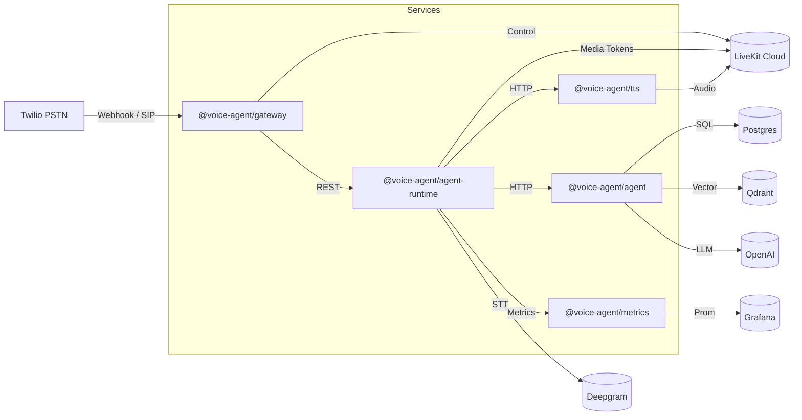
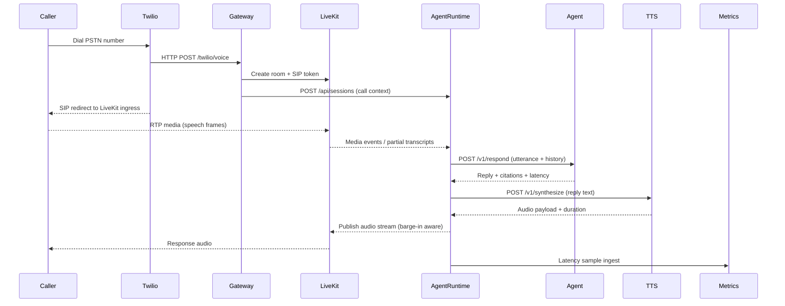
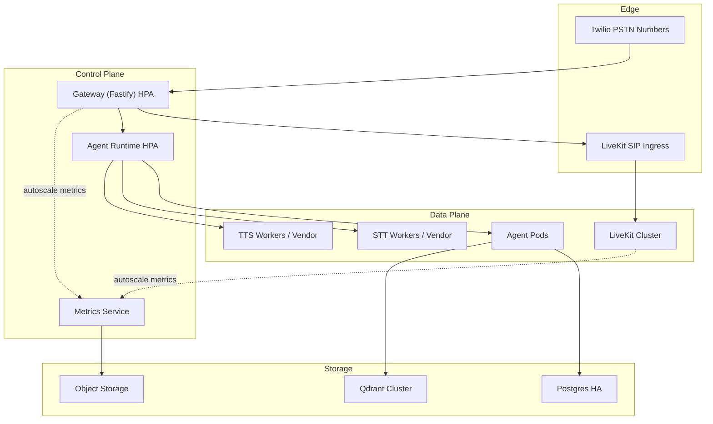

# Architecture Diagrams

## High-Level System Architecture

```mermaid
flowchart LR
   Twilio["Twilio PSTN"] -->|Webhook / SIP| Gateway["@voice-agent/gateway"]
   Gateway -->|Control| LiveKit[(LiveKit Cloud)]
   Gateway -->|REST| AgentRuntime["@voice-agent/agent-runtime"]
   AgentRuntime -->|HTTP| AgentService["@voice-agent/agent"]
   AgentRuntime -->|HTTP| TTSService["@voice-agent/tts"]
   AgentRuntime -->|Metrics| MetricsSvc["@voice-agent/metrics"]
   AgentService -->|SQL| Postgres[(Postgres)]
   AgentService -->|Vector| Qdrant[(Qdrant)]
   AgentService -->|LLM| OpenAI[(OpenAI)]
   AgentRuntime -->|STT| Deepgram[(Deepgram)]
   AgentRuntime -->|Media Tokens| LiveKit
   TTSService -->|Audio| LiveKit
   MetricsSvc -->|Prom| Grafana[(Grafana)]

   subgraph Services
   Gateway
   AgentRuntime
   AgentService
   TTSService
   MetricsSvc
   end
```

## Call Flow (Media & Control Plane)

```mermaid
sequenceDiagram
   participant Caller
   participant Twilio
   participant Gateway
   participant LiveKit
   participant AgentRuntime
   participant Agent
   participant TTS

   Caller->>Twilio: Dial PSTN number
   Twilio->>Gateway: HTTP POST /twilio/voice
   Gateway->>LiveKit: Create room + SIP token
   Gateway->>AgentRuntime: POST /api/sessions (call context)
   Twilio-->>Caller: SIP redirect to LiveKit ingress
   Caller-->>LiveKit: RTP media (speech frames)
   LiveKit-->>AgentRuntime: Media events / partial transcripts
   AgentRuntime->>Agent: POST /v1/respond (utterance + history)
   Agent-->>AgentRuntime: Reply + citations + latency
   AgentRuntime->>TTS: POST /v1/synthesize (reply text)
   TTS-->>AgentRuntime: Audio payload + duration
   AgentRuntime-->>LiveKit: Publish audio stream (barge-in aware)
   LiveKit-->>Caller: Response audio
   AgentRuntime->>Metrics: Latency sample ingest
```

## Scaling Plan

```mermaid
flowchart TD
   subgraph Edge
      TwilioPSTN["Twilio PSTN Numbers"]
      SIPIngress["LiveKit SIP Ingress"]
   end

   subgraph ControlPlane["Control Plane"]
      GatewayCluster["Gateway (Fastify) HPA"]
      AgentRuntimeCluster["Agent Runtime HPA"]
      MetricsCluster["Metrics Service"]
   end

   subgraph DataPlane["Data Plane"]
      LiveKitCluster["LiveKit Cluster"]
      STTWorkers["STT Workers / Vendor"]
      TTSWorkers["TTS Workers / Vendor"]
      AgentWorkers["Agent Pods"]
   end

   subgraph Storage
      PostgresHA["Postgres HA"]
      QdrantHA["Qdrant Cluster"]
      ObjectStore["Object Storage"]
   end

   TwilioPSTN --> GatewayCluster
   GatewayCluster --> SIPIngress
   SIPIngress --> LiveKitCluster
   GatewayCluster --> AgentRuntimeCluster
   AgentRuntimeCluster --> AgentWorkers
   AgentRuntimeCluster --> STTWorkers
   AgentRuntimeCluster --> TTSWorkers
   AgentWorkers --> PostgresHA
   AgentWorkers --> QdrantHA
   MetricsCluster --> ObjectStore
   GatewayCluster -. autoscale metrics .-> MetricsCluster
   LiveKitCluster -. autoscale metrics .-> MetricsCluster
```
