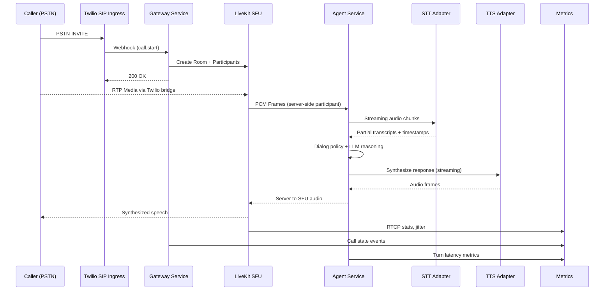

# Call Flow (Media & Control Plane)

```mermaid
sequenceDiagram
  participant Caller as Caller (PSTN)
  participant Twilio as Twilio SIP Ingress
  participant Gateway as Gateway Service
  participant LiveKit as LiveKit SFU
  participant Agent as Agent Service
  participant STT as STT Adapter
  participant TTS as TTS Adapter

  Caller->>Twilio: PSTN INVITE
  Twilio->>Gateway: Webhook (call.start)
  Gateway->>LiveKit: Create Room + Participants
  Gateway-->>Twilio: 200 OK
  Caller-->>LiveKit: RTP Media via Twilio bridge
  LiveKit->>Agent: PCM Frames (server-side participant)
  Agent->>STT: Streaming audio chunks
  STT-->>Agent: Partial transcripts + timestamps
  Agent->>Agent: Dialog policy + LLM reasoning
  Agent->>TTS: Synthesize response (streaming)
  TTS-->>Agent: Audio frames
  Agent-->>LiveKit: Server to SFU audio
  LiveKit-->>Caller: Synthesized speech
  LiveKit->>Metrics: RTCP stats, jitter
  Gateway->>Metrics: Call state events
  Agent->>Metrics: Turn latency metrics
```
