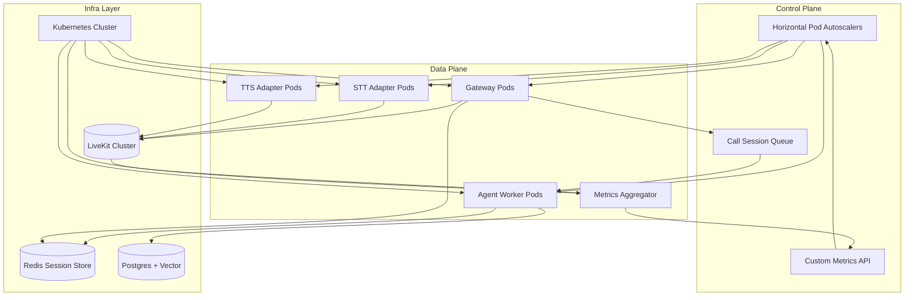

# Scaling Plan

```mermaid
graph TD
  subgraph ControlPlane[Control Plane]
    HPA[Horizontal Pod Autoscalers]
    Queue[Call Session Queue]
    MetricsAPI[Custom Metrics API]
  end

  subgraph DataPlane[Data Plane]
    GatewayPool[Gateway Pods]
    AgentWorkers[Agent Worker Pods]
    STTPool[STT Adapter Pods]
    TTSPool[TTS Adapter Pods]
    MetricsSvc[Metrics Aggregator]
  end

  subgraph Infra[Infra Layer]
    K8s[Kubernetes Cluster]
    Redis[(Redis Session Store)]
    Postgres[(Postgres + Vector)]
    LiveKit[(LiveKit Cluster)]
  end

  HPA --> GatewayPool
  HPA --> AgentWorkers
  HPA --> STTPool
  HPA --> TTSPool
  MetricsSvc --> MetricsAPI
  MetricsAPI --> HPA
  Queue --> AgentWorkers
  GatewayPool --> Queue
  AgentWorkers --> Redis
  AgentWorkers --> Postgres
  GatewayPool --> Redis
  GatewayPool --> LiveKit
  STTPool --> LiveKit
  TTSPool --> LiveKit
  LiveKit --> MetricsSvc
  K8s --> GatewayPool
  K8s --> AgentWorkers
  K8s --> STTPool
  K8s --> TTSPool
  K8s --> MetricsSvc
```
