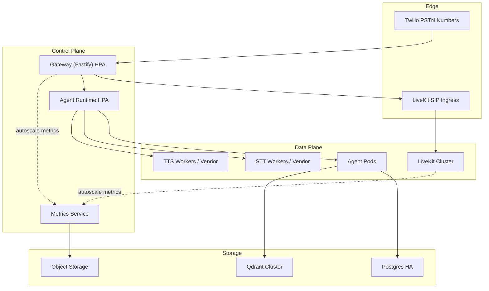

# Scaling Plan

```mermaid
flowchart TD
  subgraph Edge
    TwilioPSTN["Twilio PSTN Numbers"]
    SIPIngress["LiveKit SIP Ingress"]
  end

  subgraph ControlPlane["Control Plane"]
    GatewayCluster["Gateway (Fastify) HPA"]
    AgentRuntimeCluster["Agent Runtime HPA"]
    MetricsCluster["Metrics Service"]
  end

  subgraph DataPlane["Data Plane"]
    LiveKitCluster["LiveKit Cluster"]
    STTWorkers["STT Workers / Vendor"]
    TTSWorkers["TTS Workers / Vendor"]
    AgentWorkers["Agent Pods"]
  end

  subgraph Storage
    PostgresHA["Postgres HA"]
    QdrantHA["Qdrant Cluster"]
    ObjectStore["Object Storage"]
  end

  TwilioPSTN --> GatewayCluster
  GatewayCluster --> SIPIngress
  SIPIngress --> LiveKitCluster
  GatewayCluster --> AgentRuntimeCluster
  AgentRuntimeCluster --> AgentWorkers
  AgentRuntimeCluster --> STTWorkers
  AgentRuntimeCluster --> TTSWorkers
  AgentWorkers --> PostgresHA
  AgentWorkers --> QdrantHA
  MetricsCluster --> ObjectStore
  GatewayCluster -. autoscale metrics .-> MetricsCluster
  LiveKitCluster -. autoscale metrics .-> MetricsCluster
```
