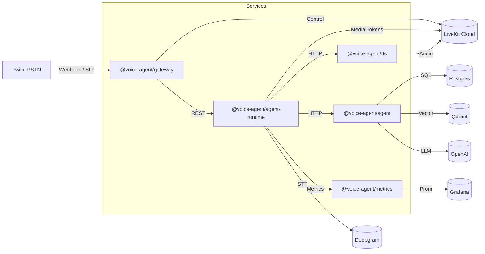

# System Architecture

```mermaid
flowchart LR
  Twilio["Twilio PSTN"] -->|Webhook / SIP| Gateway["@voice-agent/gateway"]
  Gateway -->|Control| LiveKit[(LiveKit Cloud)]
  Gateway -->|REST| AgentRuntime["@voice-agent/agent-runtime"]
  AgentRuntime -->|HTTP| AgentService["@voice-agent/agent"]
  AgentRuntime -->|HTTP| TTSService["@voice-agent/tts"]
  AgentRuntime -->|Metrics| MetricsSvc["@voice-agent/metrics"]
  AgentService -->|SQL| Postgres[(Postgres)]
  AgentService -->|Vector| Qdrant[(Qdrant)]
  AgentService -->|LLM| OpenAI[(OpenAI)]
  AgentRuntime -->|STT| Deepgram[(Deepgram)]
  AgentRuntime -->|Media Tokens| LiveKit
  TTSService -->|Audio| LiveKit
  MetricsSvc -->|Prom| Grafana[(Grafana)]

  subgraph Services
    Gateway
    AgentRuntime
    AgentService
    TTSService
    MetricsSvc
  end
```
