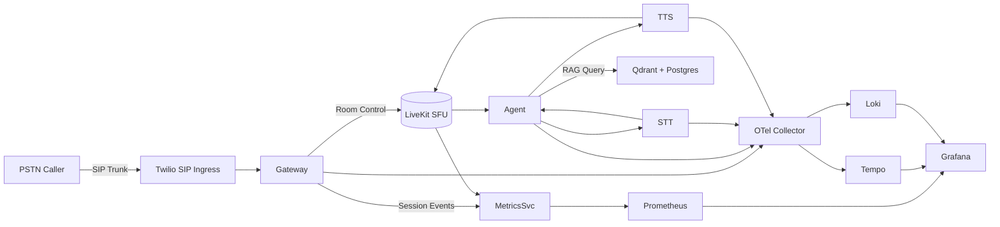

# System Architecture

```mermaid
graph LR
  PSTN["PSTN Caller"] -->|SIP Trunk| Twilio[Twilio SIP Ingress]
  Twilio --> Gateway
  Gateway -->|Room Control| LiveKit[(LiveKit SFU)]
  Gateway -->|Session Events| MetricsSvc
  LiveKit --> Agent
  Agent --> STT
  Agent -->|RAG Query| KB[Qdrant + Postgres]
  Agent --> TTS
  STT --> Agent
  TTS --> LiveKit
  MetricsSvc --> Prometheus
  LiveKit --> MetricsSvc
  Gateway --> Otel[OTel Collector]
  Agent --> Otel
  STT --> Otel
  TTS --> Otel
  Otel --> Tempo
  Otel --> Loki
  Prometheus --> Grafana
  Tempo --> Grafana
  Loki --> Grafana
```
